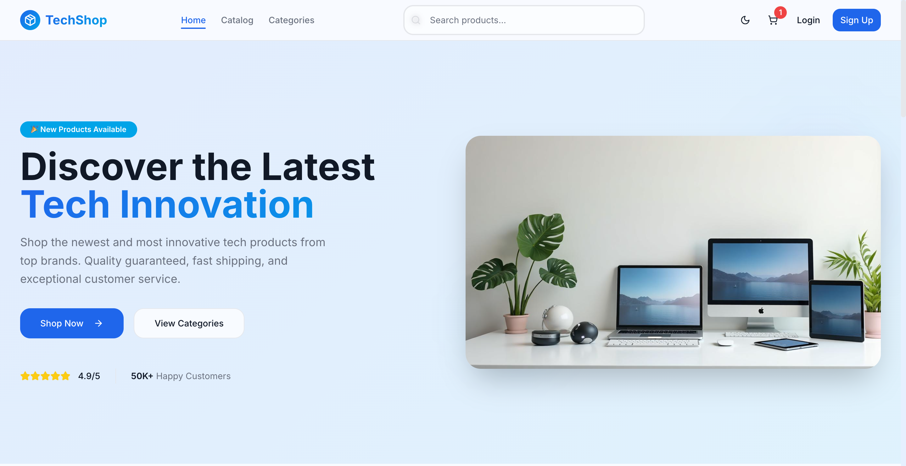
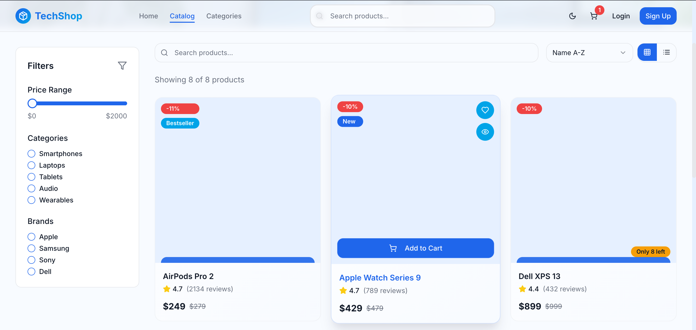
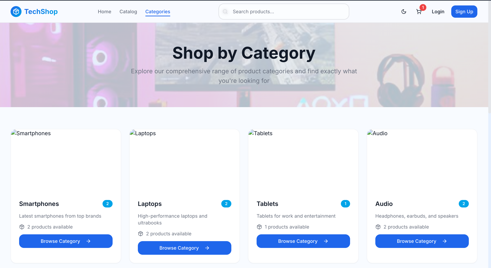
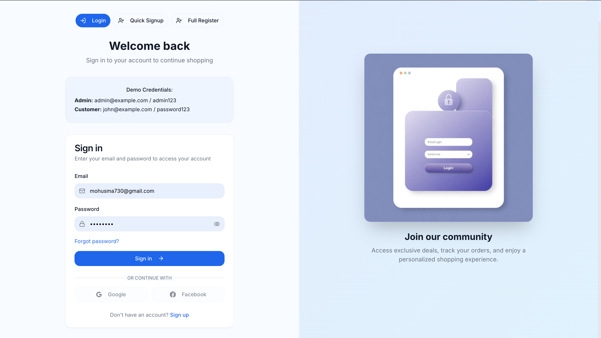
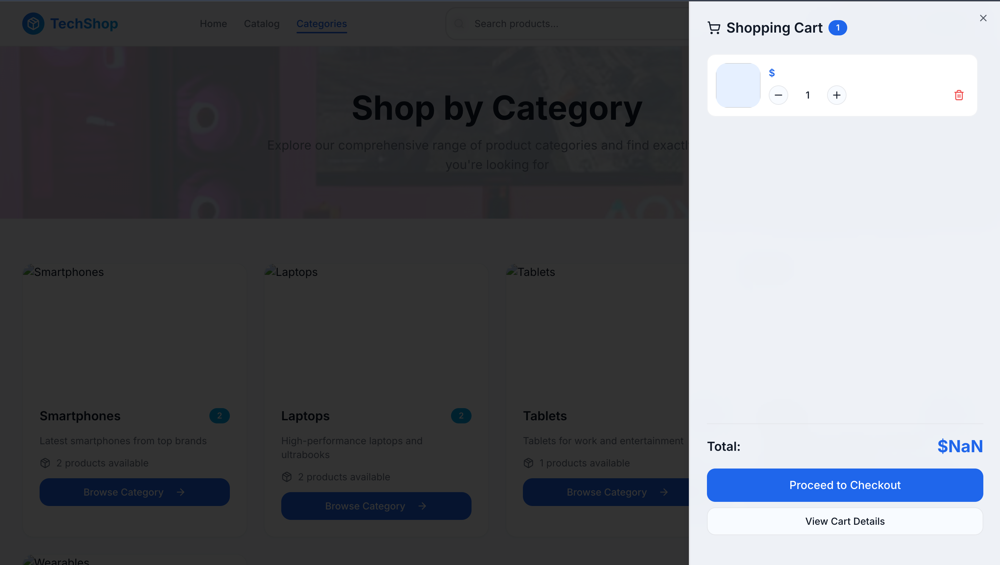

# 🛍️ E-commerce Template React

Un template moderne et professionnel pour applications e-commerce développé avec React, TypeScript et Tailwind CSS.

## ✨ Fonctionnalités

- 🎨 **Interface moderne** avec design responsive et animations fluides
- 🔐 **Système d'authentification** complet (connexion, inscription, récupération de mot de passe)
- 🛒 **Gestion du panier** avec persistance des données
- 📱 **Design responsive** optimisé pour tous les appareils
- 🎯 **Navigation intuitive** avec breadcrumbs et recherche
- 🌙 **Thème sombre/clair** avec persistance des préférences
- ⚡ **Performance optimisée** avec Vite et React 18

## 🖼️ Captures d'écran

### Page d'accueil


### Catalogue des produits


### Catégories


### Connexion


### Panier


## 🚀 Technologies utilisées

- **Frontend**: React 18 + TypeScript
- **Styling**: Tailwind CSS + CSS Modules
- **Build Tool**: Vite
- **State Management**: Zustand
- **UI Components**: Shadcn/ui
- **Routing**: React Router DOM
- **Icons**: Lucide React

## 📋 Prérequis

- Node.js (version 18 ou supérieure)
- npm ou yarn
- Git

## 🛠️ Installation

### Étape 1: Cloner le repository

```bash
git clone https://github.com/mohamed-usma1937/E-commerce-Template-React-.git
```

### Étape 2: Naviguer vers le répertoire du projet

```bash
cd E-commerce-Template-React-
```

### Étape 3: Installer les dépendances

```bash
npm install
```

### Étape 4: Démarrer le serveur de développement

```bash
npm run dev
```

L'application sera accessible à l'adresse : `http://localhost:5173`

## 📁 Structure du projet

```
src/
├── components/          # Composants réutilisables
│   ├── ui/             # Composants UI de base (shadcn/ui)
│   ├── auth-nav.tsx    # Navigation d'authentification
│   ├── cart-drawer.tsx # Tiroir du panier
│   └── ...
├── pages/              # Pages de l'application
│   ├── auth/           # Pages d'authentification
│   ├── home.tsx        # Page d'accueil
│   ├── catalog.tsx     # Catalogue des produits
│   └── ...
├── store/              # Gestion d'état (Zustand)
├── hooks/              # Hooks personnalisés
├── layouts/            # Layouts de l'application
└── data/               # Données statiques (JSON)
```

## 🔧 Scripts disponibles

```bash
# Démarrage du serveur de développement
npm run dev

# Build de production
npm run build

# Prévisualisation du build
npm run preview

# Vérification du code avec ESLint
npm run lint

# Vérification des types TypeScript
npm run type-check
```

## 🌟 Fonctionnalités principales

### Authentification
- Connexion avec email/mot de passe
- Inscription de nouveaux utilisateurs
- Récupération de mot de passe
- Navigation sécurisée

### Catalogue
- Affichage des produits avec filtres
- Navigation par catégories
- Recherche de produits
- Pagination

### Panier
- Ajout/suppression de produits
- Modification des quantités
- Calcul automatique des totaux
- Persistance des données

## 🎨 Personnalisation

Le template utilise Tailwind CSS pour le styling, ce qui permet une personnalisation facile :

- Modifiez `tailwind.config.ts` pour les couleurs et thèmes
- Ajustez les composants dans `src/components/ui/`
- Personnalisez les layouts dans `src/layouts/`

## 📱 Responsive Design

L'application est entièrement responsive et s'adapte à tous les écrans :
- Mobile-first approach
- Breakpoints optimisés
- Navigation adaptative
- Composants flexibles

## 🔒 Sécurité

- Validation des entrées utilisateur
- Gestion sécurisée des sessions
- Protection des routes sensibles
- Validation côté client et serveur

## 🚀 Déploiement

### Build de production

```bash
npm run build
```

### Déploiement sur Vercel

```bash
npm install -g vercel
vercel
```

### Déploiement sur Netlify

```bash
npm install -g netlify-cli
netlify deploy
```

## 🤝 Contribution

Les contributions sont les bienvenues ! N'hésitez pas à :

1. Fork le projet
2. Créer une branche pour votre fonctionnalité
3. Commiter vos changements
4. Pousser vers la branche
5. Ouvrir une Pull Request

## 📄 Licence

Ce projet est sous licence MIT. Voir le fichier `LICENSE` pour plus de détails.

## 👨‍💻 Auteur

**Mohamed Seddik Bouchelaghem**
- Email: mohamedseddikbouchelaghem@gmail.com
- Téléphone: +213 779 154 202
- Site web: [Portfolio personnel]

## 📞 Support

Pour toute question ou problème :
- Ouvrez une issue sur GitHub
- Contactez l'auteur via email
- Consultez la documentation

---

⭐ N'oubliez pas de donner une étoile au projet si vous l'aimez !
